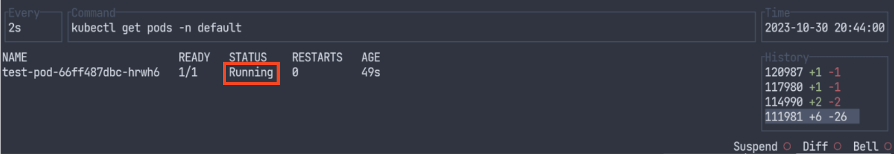
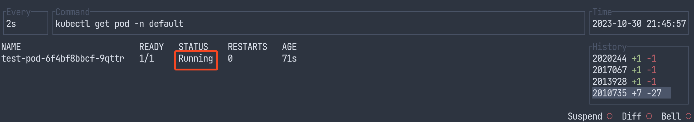

Kubernetes のノードプロビジョナーは、何を使っていますでしょうか。
ブログや技術記事を見ていると[Cluster Autoscaler]（以後、CA）が多いように感じます。
CAを利用している者の感想としては、ノードのプロビジョニング（Pod のスケジューリング）スピードがネック です。
ノードのプロビジョニングが急激なトラッフィク増加に耐えられないため、事前にわかっている場合は、手動でアプリケーション Pod を増加させています。これが地味に結構煩わしいので自動でやって欲しい。

そこで CA の課題であるポッドのスケジューリングを改善した [Karpenter] を試してみます。
今回は、CA と Karpenter の Pod スケジューリング（Ready になる）までの時間を計測し、比較しすることでどのくらいの差があるのか確認します。

試験的に Karpenter を導入していますが、体感的に Apply してから Pod が Ready になるまでかなり速いです。

CA, Karpenter の最適化や環境次第では、より良い結果が得られるかも知れませんが、そこまで実施していないため、大体このくらいなんだなーくらいで知っていただけると嬉しいです。

## 検証内容

新しいノードが必ず起動されるような Deployment を作成する manifest を Apply し、 Pod が Ready になるまでの時間を計測します。
CA, Karpenter ともに基本的にGitHub に置かれている状態のまま利用しますが、必要に応じて最低限変更しています。

## 環境情報

| コンポーネント | バージョン |
| - | - |
| Kubernetes(EKS) | v1.27.6-eks-f8587cb |
| Karpenter       | v0.29.2 |
| Cluster Autoscaler | v1.24.2 |

## 使用する manifest

resources をいい感じに設定し、新しいノードが起動するようにします。

```yaml
apiVersion: apps/v1
kind: Deployment
metadata:
  labels:
    app: test-pod
  name: test-pod
spec:
  minReadySeconds: 10
  replicas: 1
  selector:
    matchLabels:
      app: test-pod
  template:
    metadata:
      labels:
        app: test-pod
    spec:
      affinity:
        nodeAffinity:
          requiredDuringSchedulingIgnoredDuringExecution:
            nodeSelectorTerms:
              - matchExpressions:
                  # Karpenter の場合
                  - key: karpenter.sh/provisioner-name
                    operator: In
                    values:
                      - default
      containers:
        - image: nginx
          imagePullPolicy: IfNotPresent
          command:
            - sleep
            - infinity
          name: debian
          resources:
            limits: #
              cpu: "2000m"
              memory: "8000Mi"
```

## 検証

[viddy] を使って確認します。Time Machine mode で過去に戻って確認できるので、見逃して大丈夫です。

### Karpenter

manifest を Apply 後、20:43:11 に Pod が Pending


25秒後、Node が NotReady で起動


12秒（合計37秒）後、Node が Ready となり、Pod の STATUS が ContainerCreating に更新


合計49秒後、Pod が Running となった



### Cluster Autoscaler

manifest を Apply 後、21:44:47 に Pod が Pending


41秒後、Node が NotReady で起動


16秒（合計57秒）後、Node が Ready となり、Pod の STATUS が ContainerCreating に更新


合計1分10秒後、 Pod が Running となった



## 結果

Node のプロビジョニングは、以下の結果となりました。
- Karpenter 37秒
- Cluster Autoscaler 57秒
Karpenter は CA の約2/3ほどの時間で Node をプロビジョニングできることがわかりました。

## 感想

もう少し差があるのかと思っていましたが、思っていたより差はありませんでした。
ただ、20秒は結構大きい差だと思うので検証結果次第では CA から Karpenter への乗り換えもありではないでしょうか。
どちらのプロビジョニングスピードでも急激なトラフィックへの対策は対応しきれないため、とりあえずは引続き手動で Pod 数を増やす必要があります。
自動でいい感じにやってくれるなにかないかなーと思っています。

実際、Karpenter を最初に触ったのが1年以上前（v0.19）で、Node のプロビジョニング以外のところで少し課題感がありプロダクションへの採用は見送りました。
最近AWSの方から聞いた話では、改善されつつありプロダクションへの採用ができる可能性もありそうだったため、再度検討してみます。

[Cluster Autoscaler]: https://github.com/kubernetes/autoscaler/tree/master/cluster-autoscaler
[Karpenter]: https://karpenter.sh/
[viddy]: https://github.com/sachaos/viddy
