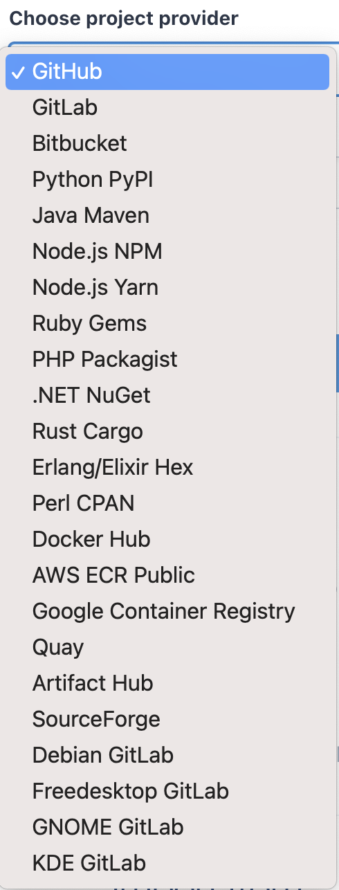

インフラからSREに転職しまして、現在、AWS/Kubernetes/Istio を触っているわけですが、
Kubernetesや関連コンポーネントはリリース頻度が高く、気づいたら最新から3マイナーバージョン遅れている なんてことがよくあるわけです。

Kubernetesと2~3つの関連コンポーネント程度であれば、なんとか気にして追うことができるのですが
導入しているコンポーネントが10とかを超えてくると、何がどのバージョンを使っているのすらも忘れていたりします。

そのため、新しいバージョンがリリースされた際に通知してくれる new releases というサービスがあったので、紹介したいと思います。

https://newreleases.io/

サービス名そのままですが、新しいリリースをお知らせしてくれるサービスとなります。

